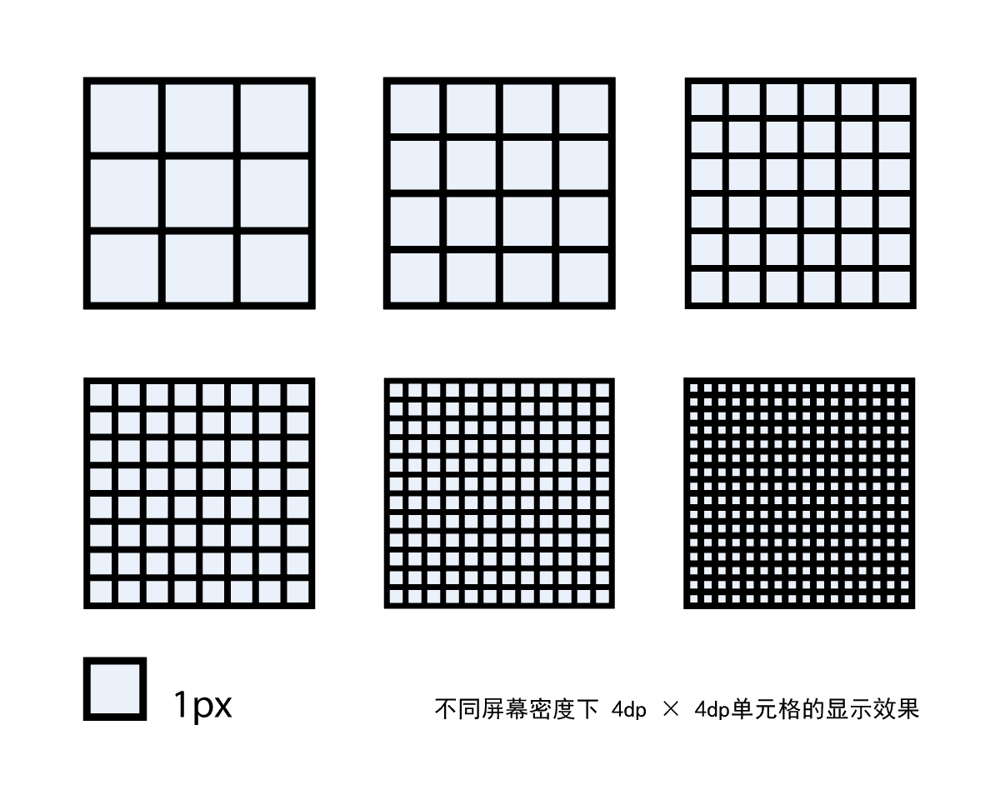

## Android相对屏幕适配原理与方案

> 描述一块屏幕的大小，可以从屏幕各个参数入手，其中比较重要的三个参数分别是尺寸、分辨率以及密度。

**尺寸**
以对角线长度为准，单位inch。

**分辨率**
横向像素×纵向像素，单位pixel。

**密度**
单位长度上的像素数，单位ppi（pixels per inch）或dpi（dots per inch）。

Android开发中能够有效地描述一块屏幕的参数是密度。根据密度的不同划分了大致的几个范围：
- ldpi（≈120dpi）
- mdpi（≈160dpi）
- hdpi（≈240dpi）
- xhdpi（≈320dpi）
- xxhdpi（≈480dpi）
- xxxhdpi（≈640dpi）

xxhdpi以上的设备的像素点，一般人眼已经看不出，再高也只是增加图像显示锐化，徒增电量损耗耳。

为了使用密度来描述屏幕，Android推荐使用dp作为UI尺寸的度量单位而不是传统的px。所谓dp是density independent pixel的缩写，即密度无关像素，开发人员在布局UI时，透明地将dp当作是px来使用，SDK会根据设备屏幕的密度转换为对应的实际px值。dp的定义是160dpi的屏幕下，实际的1px就是1dp，而在其它的密度的屏幕下，1dp对应的px值就要按比例缩放。公式如下：
```math
valueInPX = valueInDP × (density / 160)
```

因此：
1dp在各个密度屏幕下对应的px数分别为：
- ldpi

```math
valueInPx = 1 × (120 / 160) = 0.75
```
> 即0.75px，而屏幕无法呈现0.75px，所以相当于4dp对应3px。

- mdpi

```math
valueInPx = 1 × (160 / 160) = 1
```
> 标准的一一对应。

- hdpi

```math
valueInPx = 1 × (240 / 160) = 1.5
```
> 同理相当于2dp对应3px。

- xhdpi

```math
valueInPx = 1 × (320 / 160) = 2
```
> 1dp对应2px。

- xxhdpi：

```math
valueInPx = 1 × (480 / 160) = 3
```
> 1dp对应3px。

- xxxhdpi：

```math
 valueInPx = 1 x (640 / 160) = 4
```
> 1dp对应4px。



如图所示一个小正方形代表一个物理像素，4dp在6种密度下对应的像素数分别为3，4，6，8，12，16。可以看出xxxhdpi下显示的UI最精细。

SDK对应选择
- res/drawable-ldpi
- res/drawable-mdpi
- res/drawable-hdpi
- res/drawable-xhdpi
- res/drawable-xxhdpi
- res/drawable-xxxhdpi

文件夹下的资源适配屏幕。

在制作Android APP ICON时，对应密度下的官方尺寸为：
- 36×36
- 48×48
- 72×72
- 96×96
- 144×144
- 192×192

所以，在开发Android应用时，我们要根据UI设计师的参考尺寸来放置切图，比如，我们的应用需要显示一个宽度大约是屏幕一半的logo，设计师从1080x1920的设计图导出该logo，我们就应该摆放至res/drawable-xxhdpi下，这样即使运行该App的手机是720x1280或1440x2560或其它分辨率，logo显示效果也大致是屏幕的一半。当然，Android手机将切图由大转小的效果优于由小转大，所以切图的参考屏幕尺寸越大，各分辨率手机显示整体效果越好。最理想情况是针对6大密度切6张图，但是权衡目标用户各分辨率手机市场占有率及UI工作量，一般情况切一款即可满足。

现在主流Android手机的屏幕尺寸是720x1280与1080x1920，1440x2560会越来越多，还有一些特殊的尺寸（比如魅族的机型），也就是说屏幕密度集中于xhdpi~xxxhdpi，可以参考网址[screensiz.es](http://screensiz.es/phone)。

总结如下表所示

|name|icon size|scope|代表屏幕|scale|
|--:|:--:|--:|:--:|:--|
|ldpi|36x36|0~120dpi|现在鲜有|0.75|
|mdpi|48x48|120~160dpi|320x480|1|
|hddpi|72x72|160~240dpi|480x800|1.5|
|xhdpi|96x96|240~320dpi|720x1280|2|
|xxhdpi|144x144|320~480dpi|1080x1920|3|
|xxxhdpi|192x192|480~640dpi|1440x2560|4|

以上阐述的屏幕适配方法是相对适配，关于Android相对屏幕适配的方法代码参见[AndroidScreenMatchingUtil](https://github.com/hayukleung/AndroidScreenMatchingUtil)。

## Android绝对屏幕适配原理与方案

> Android SDK已经为我们做好了相对屏幕适配的方案，即采用DP作为UI尺寸的描述单位，绝对屏幕适配方案则希望精确描述UI尺寸，力求UI在所有设备上显示效果一致。

已经实现的方案有

1. [android-percent-support-lib-sample](https://github.com/JulienGenoud/android-percent-support-lib-sample)
2. [AndroidAutoLayout](https://github.com/hongyangAndroid/AndroidAutoLayout)
3. [鸿洋的博客](http://blog.csdn.net/lmj623565791/article/details/45460089)

基本思想是采用百分比来描述UI尺寸。

示例代码参见[lib-app-screen](https://github.com/hayukleung/app/tree/master/lib-app-screen)