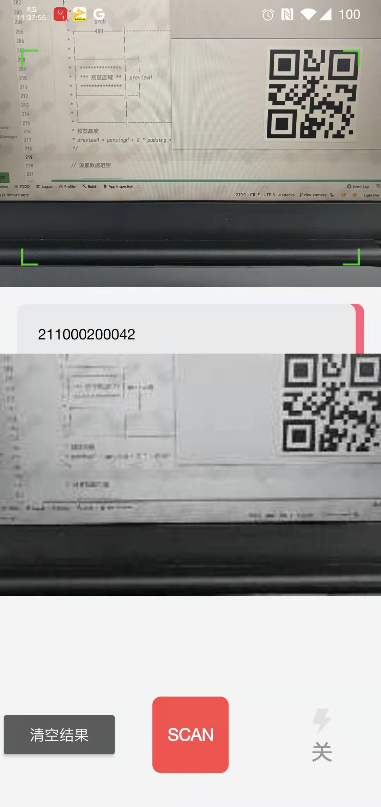

[TOC]

# ZXing



1. 绿角包裹的矩形区域就是解析区域

```java
PlanarYUVLuminanceSource(
  // 原始数据
  byte[] yuvData, int dataWidth, int dataHeight,
  // padding，解析区域左始与顶始
  int left, int top,、
  // 解析区域宽高范围
  int width, int height,
  // 是否水平翻转
  boolean reverseHorizontal)
```