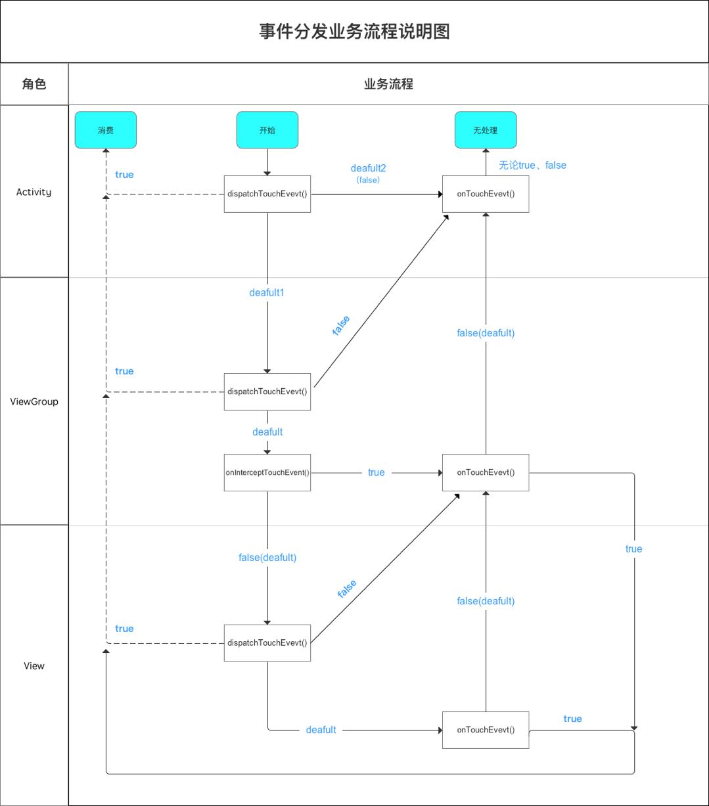

[TOC]

# Android 事件分发

- Android 事件分发就是对 MotionEvent 的分发过程

## 流程



## 三个重要方法

```java
// `dispatchTouchEvent`、`onInterceptTouchEvent`、`onTouchEvent`的关系
public boolean dispatchTouchEvent(MotionEvent ev) {
  boolean consume = false;
  if (onInterceptTouchEvent(ev)) {
    consume = onTouchEvent(ev);
  } else {
    consume = child.dispatchTouchEvent(ev);
  }
  return consume;
}
// 任玉刚. Android开发艺术探索 (Kindle 位置 2721-2725). 电子工业出版社. Kindle 版本. 
```

## 事件监听的优先级

- `OnClickListener` < `onTouchEvent` < `OnTouchListener`

```txt
当一个 View 需要处理事件时，如果它设置了 OnTouchListener，那么 OnTouchListener 中的
 onTouch 方法会被回调。 这时事件如何处理还要看 onTouch 的 返回值，如果返回 false，则当
前 View 的 onTouchEvent 方法会被调用；如果返回 true，那么 onTouchEvent 方法将不会被调
用。由此可见，给 View 设置的 OnTouchListener，其优先级比 onTouchEvent 要高。在
 onTouchEvent 方法中，如果当前设置的有 OnClickListener，那么它的 onClick 方法会被调用。
可以看出，平时我们常用的 OnClickListener，其优先级最低，即处于事件传递的尾端。

// 任玉刚. Android开发艺术探索 (Kindle 位置 2730-2734). 电子工业出版社. Kindle 版本. 
```