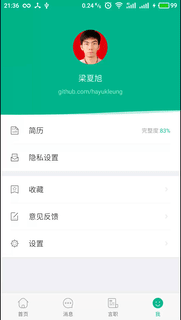
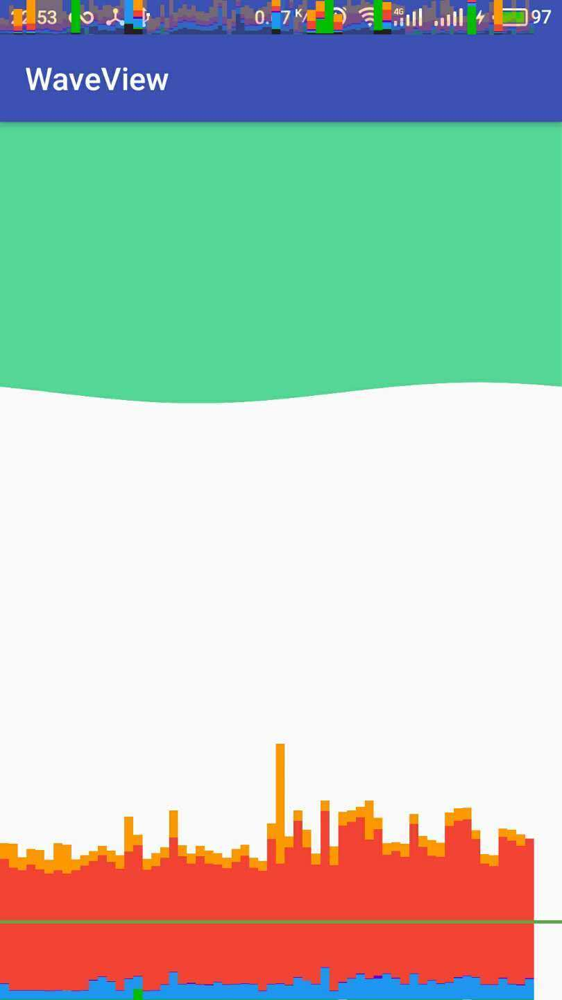

## 写在前面
最近在找工作，安装了某勾网 APP，登录后看到用户信息绿色背板那骚气的波浪。

在开发者模式里开启了 GPU 渲染情况信息展示，性能不差。

好，自己也写一个。

## 百度了一下正弦曲线的画法
整条正弦曲线是由 N 多条竖线排列起来组合而成。
onDraw 代码如下：
```java
// 振幅
int amplitude = 20;

int height = getHeight();
// 波长
int width = getWidth();
int index = 0;

while (index < width) {
    float endY = (float) (Math.sin((float) index / (float) width * 2f * Math.PI + mTheta) * (float) amplitude + height - amplitude);
    canvas.drawLine(index, 0, index, endY, mPaint);
    index++;
}
```
看下性能：


非常明显，百度上的文章抄来抄去，错了大家一起错，在 onDraw 方法里执行成百上千次 canvas.drawXXX 方法，性能不差才怪。

## 改良方法
我试着用 Path 绘制路径这个 API。onDraw 代码如下：

```java
// 振幅
int amplitude = 20;

int height = getHeight();
// 波长
int width = getWidth();
int index = 0;

mPath.reset();
mPath.moveTo(0, 0);
while (index <= width) {
    float endY = (float) (Math.sin((float) index / (float) width * 2f * Math.PI + mTheta)
          * (float) amplitude + height - amplitude);
    mPath.lineTo(index, endY);
    // Log.e("xxx", String.format("(%.4f, %.4f)", (float) index, endY));
    index++;
}
mPath.lineTo(index - 1, 0);
mPath.close();

canvas.drawPath(mPath, mPaint);
```

onDraw 里只有一次 drawXXX 方法，性能已经达标，接下来定时修改那个 mTheta 变量，波浪就会动起来了。

## 总结
百度虽好，可不能照搬照抄。

源码放置了自定义 View 集合，找到 WaveView 那个类就可以看到了。
[GitHub 地址](https://github.com/hayukleung/view)
