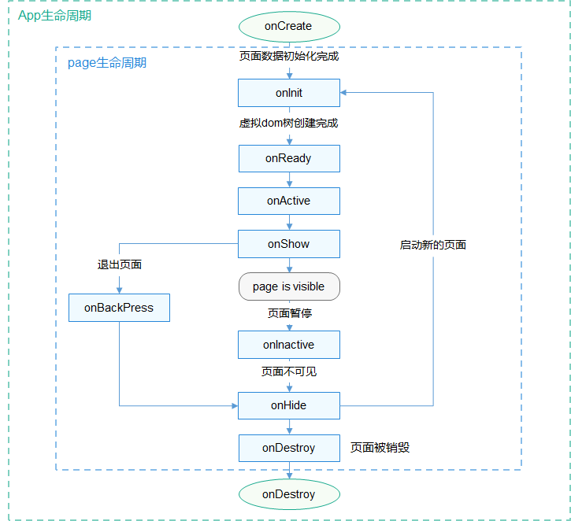

[TOC]

# 生命周期

## app.js 应用生命周期

onCreate | () => void | 应用创建 | 当应用创建时调用。

onShow6+

() => void

应用处于前台

当应用处于前台时触发。

onHide6+

() => void

应用处于后台

当应用处于后台时触发。

onDestroy

() => void

应用销毁

当应用退出时触发。