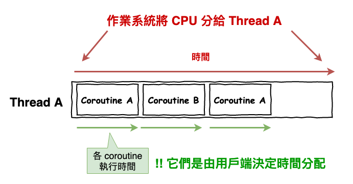
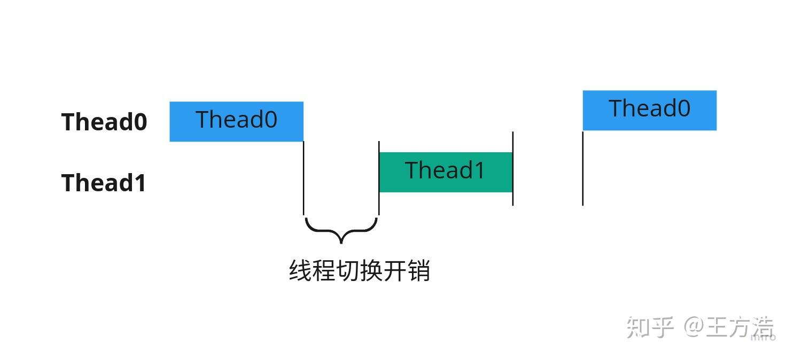
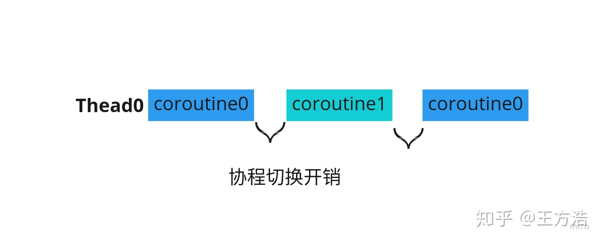

[TOC]

# Kotlin Coroutine 协程

```
Kotlin Coroutine 与一般概念的 Coroutine 不一样
```

## 通常意义的 Coroutine



## 线程与通常意义协程的对比

### 切换开销对比




## Kotlin 里的 Coroutine 与一般概念的 Coroutine 不同

- 一套 Kotlin 封装起来的`线程 API`，Kotlin Coroutine 就是线程
- 非阻塞式挂起：非阻塞式指的是用看起来阻塞的代码写出非阻塞性的操作，挂起的本质只是`切线程`，并且支持自动切线程

### launch

```
创建一个协程，并在指定线程上运行
Dispatchers.IO
Dispatchers.Main
```

```kotlin
// 1. IO 线程运行
launch(Dispatchers.IO) {
  // run background, e.g. update data to db
}

// 2. 主线程运行
launch(Dispatchers.Main) {
  // run foreground, e.g. update UI
}

// 3. 多任务数据合并
launch(Dispatchers.Main) {
  val data1 = async { api.getData1() }
  val data2 = async { api.getData2() }
  val merged = suspendingMerge(data1, data2)
  ui(merged)
}

// 4. 线程切换 - 写法 1
launch(Dispatchers.Main) {
  val data = withContext(Dispatchers.IO) {
    // run on IO thread
    getData()
  }
  // now back to UI thread: switch thread automatically
  // use data
}

// 5. 线程切换 - 写法 2
launch(Dispatchers.Main) {
  val data = suspendingGetData()
  // use data
}

suspend fun suspendingGetData() {
  withContext(Dispatchers.IO) {
    getData()
  }
}
```

## 参考链接

1. [知乎大佬](https://zhuanlan.zhihu.com/p/172471249)
2. [扔物线](https://www.ixigua.com/6846651601583604238?logTag=913c722a7192cbe6470f)