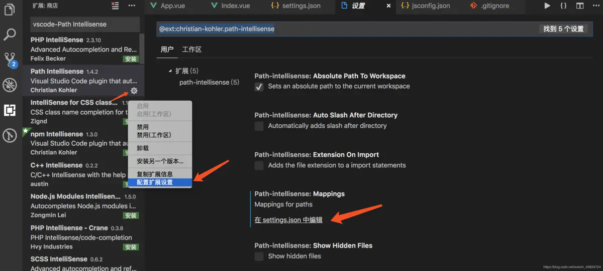

[TOC]

# Visual Studio Code 配置

> C:\Users\hayuk\AppData\Roaming\Code\User\settings.json

## 1. 路径提示插件 path-intellisense



```json
"path-intellisense.mappings": {
  "@": "${workspaceRoot}/src"
}
```

## 2. Ctrl + 鼠标左键跳转

`package.json`文件同目录下编辑`jsconfig.json`或`tsconfig.json`

```json
{
  "compilerOptions": {
    "baseUrl": "./",
    "paths": {
      "@/*": ["src/*"]
    }
  },
  "exclude": [
    "node_modules"
  ]
}
```

## 3. Terminal 配置

```json
"terminal.integrated.profiles.windows": {
  "git.bash": {
    "path": "D:\\development\\VisualStudioCodeConfig\\mingw64-visual-studio-code.bat",
    "args": []
  }
},
"terminal.integrated.defaultProfile.windows": "git.bash",
```

[CSDN 链接](https://blog.csdn.net/gaoxiaoba/article/details/118191161)

## 4. 等宽字体配置

[简书](https://www.jianshu.com/p/46fdb5d275a6#comments)
[GitHub](https://github.com/be5invis/Sarasa-Gothic/releases)