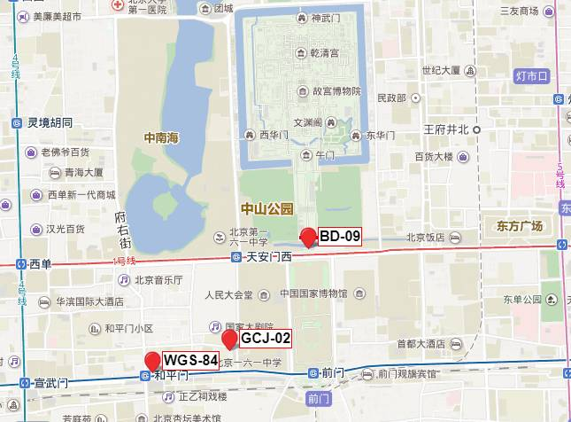

# 地理坐标系

[来源](https://github.com/hujiulong/gcoord/wiki/%E5%9C%B0%E7%90%86%E5%9D%90%E6%A0%87%E7%B3%BB)

## 为什么需要转换坐标系？
因为国内对地理坐标有特殊的政策，所有电子地图必须对位置做偏移处理，这导致了从底层接口得到的经纬度坐标展示在地图上会有偏移。这种偏移不是线性的，不能简单地通过加减某个值来校正，并且不同的地图提供商采用的算法也不一样，例如百度地图和高德地图就采用了不同的偏移方式。更详细的信息可以阅读下文的关于坐标系。

导航电子地图在公开出版、销售、传播、展示和使用前，必须进行空间位置技术处理。
— GB 20263―2006《导航电子地图安全处理技术基本要求》，4.1

## 关于坐标系
我们通常用经纬度来表示一个地理位置，但是由于一些原因，我们从不同渠道得到的经纬度信息可能并不是在同一个坐标系下。

高德地图、腾讯地图以及谷歌中国区地图使用的是GCJ-02坐标系
百度地图使用的是BD-09坐标系
底层接口(HTML5 Geolocation或ios、安卓API)通过GPS设备获取的坐标使用的是WGS-84坐标系
不同的坐标系之间可能有几十到几百米的偏移，所以在开发基于地图的产品，或者做地理数据可视化时，我们需要修正不同坐标系之间的偏差。

### WGS-84 - 世界大地测量系统
WGS-84（World Geodetic System, WGS）是使用最广泛的坐标系，也是世界通用的坐标系，GPS设备得到的经纬度就是在WGS84坐标系下的经纬度。通常通过底层接口得到的定位信息都是WGS84坐标系。

### GCJ-02 - 国测局坐标
GCJ-02（G-Guojia国家，C-Cehui测绘，J-Ju局），又被称为火星坐标系，是一种基于WGS-84制定的大地测量系统，由中国国测局制定。此坐标系所采用的混淆算法会在经纬度中加入随机的偏移。

国家规定，中国大陆所有公开地理数据都需要至少用GCJ-02进行加密，也就是说我们从国内公司的产品中得到的数据，一定是经过了加密的。绝大部分国内互联网地图提供商都是使用GCJ-02坐标系，包括高德地图，谷歌地图中国区等。

### BD-09 - 百度坐标系
BD-09（Baidu, BD）是百度地图使用的地理坐标系，其在GCJ-02上多增加了一次变换，用来保护用户隐私。从百度产品中得到的坐标都是BD-09坐标系。

不同坐标系下的点在百度地图上会有偏移

## 相互转换
GCJ-02和BD-09都是用来对地理数据进行加密的，所以也不会公开逆向转换的方法。理论上，GCJ-02的加密过程是不可逆的，但是可以通过一些方法来逼近接原始坐标，并且这种方式的精度很高。gcoord使用的纠偏方式达到了厘米级的精度，能满足绝大多数情况。