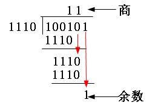
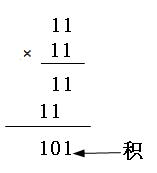
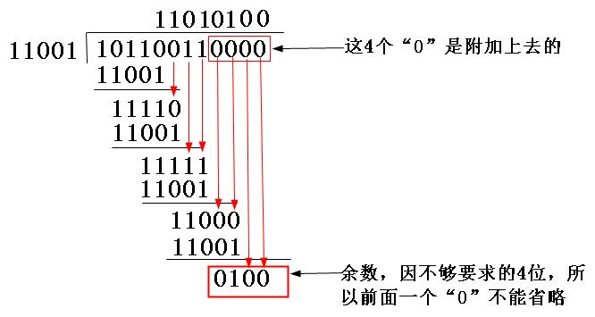

[TOC]

# 循环冗余校验码

## 模2算术

相当于二进制中的逻辑异或运算。也就是比较后，两者对应位相同则结果为 0，不同则结果为 1。

### 模2加法
1+1=0，0+1=1，0+0=0
无进位，也无借位

### 模2减法
1-1=0，0-1=1，1-0=1，0-0=0
也无进位，无借位

### 模2除法

100101 除以 1110，结果得到商为11，余数为1

### 模2乘法

11×11=101

## 步骤

（1）先选择（可以随机选择，也可按标准选择，具体在后面介绍）一个用于在接收端进行校验时，对接收的帧进行除法运算的除数（是二进制比较特串，通常是以多项方式表示，所以CRC又称多项式编码方法，这个多项式也称之为“生成多项式”）。

（2）看所选定的除数二进制位数（假设为k位），然后在要发送的数据帧（假设为m位）后面加上k-1位“0”，然后以这个加了k-1个“0“的新帧（一共是m+k-1位）以“模2除法”方式除以上面这个除数，所得到的余数（也是二进制的比特串）就是该帧的CRC校验码，也称之为FCS（帧校验序列）。但要注意的是，余数的位数一定要是比除数位数只能少一位，哪怕前面位是0，甚至是全为0（附带好整除时）也都不能省略。

（3）再把这个校验码附加在原数据帧（就是m位的帧，注意不是在后面形成的m+k-1位的帧）后面，构建一个新帧发送到接收端，最后在接收端再把这个新帧以“模2除法”方式除以前面选择的除数，如果没有余数，则表明该帧在传输过程中没出错，否则出现了差错。

从上面可以看出，CRC校验中有两个关键点：一是要预先确定一个发送端和接收端都用来作为除数的二进制比特串（或多项式）；二是把原始帧与上面选定的除进行二进制除法运算，计算出FCS。前者可以随机选择，也可按国际上通行的标准选择，但最高位和最低位必须均为“1”，如在IBM的SDLC（同步数据链路控制）规程中使用的CRC-16（也就是这个除数一共是17位）生成多项式g（x）= x16 + x15 + x2 +1（对应二进制比特串为：11000000000000101）；而在ISO HDLC（高级数据链路控制）规程、ITU的SDLC、X.25、V.34、V.41、V.42等中使用CCITT-16生成多项式g（x）=x16 + x15 + x5 +1（对应二进制比特串为：11000000000100001）。

## 示例

CRC校验码的计算示例
由以上分析可知，既然除数是随机，或者按标准选定的，所以CRC校验的关键是如何求出余数，也就是CRC校验码。

下面以一个例子来具体说明整个过程。现假设选择的CRC生成多项式为G（X） = X4 + X3 + 1，要求出二进制序列10110011的CRC校验码。下面是具体的计算过程：

（1）首先把生成多项式转换成二进制数，由G（X） = X4 + X3 + 1可以知道（，它一共是5位（总位数等于最高位的幂次加1，即4+1=5），然后根据多项式各项的含义（多项式只列出二进制值为1的位，也就是这个二进制的第4位、第3位、第0位的二进制均为1，其它位均为0）很快就可得到它的二进制比特串为11001。

（2）因为生成多项式的位数为5，根据前面的介绍，得知CRC校验码的位数为4（校验码的位数比生成多项式的位数少1）。因为原数据帧10110011，在它后面再加4个0，得到101100110000，然后把这个数以“模2除法”方式除以生成多项式，得到的余数，即CRC校验码为0100，如图所示。注意参考前面介绍的“模2除法”运算法则。

（3）把上步计算得到的CRC校验码0100替换原始帧101100110000后面的四个“0”，得到新帧101100110100。再把这个新帧发送到接收端。

（4）当以上新帧到达接收端后，接收端会把这个新帧再用上面选定的除数11001以“模2除法”方式去除，验证余数是否为0，如果为0，则证明该帧数据在传输过程中没有出现差错，否则出现了差错。

